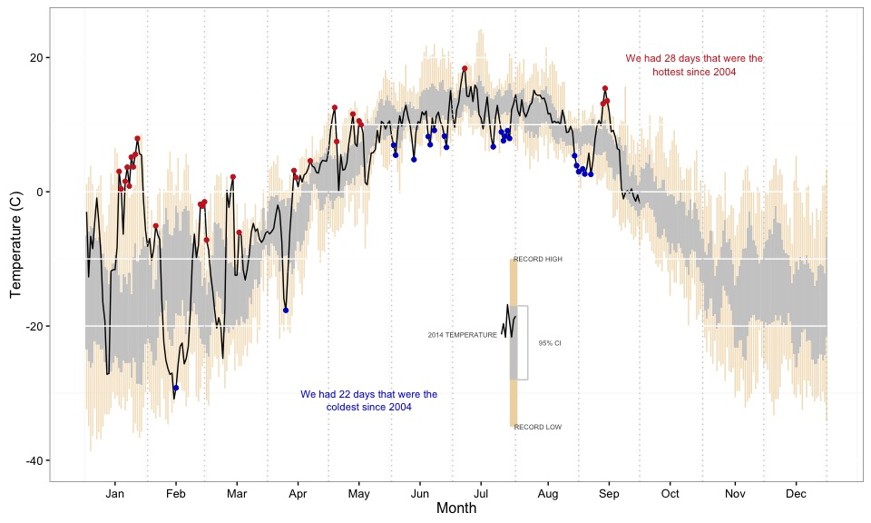

HOBO summaries
================
Ecosystem Dynamics Research Lab
March 18, 2015

Introduction
============

This is documant contains summaries of the HOBO weather station. The data can be found at [Bonanza Creek LTER](http://www.lter.uaf.edu/data_detail.cfm?datafile_pkey=453). The range of data is 2004-05-19 to 2014-09-30.

